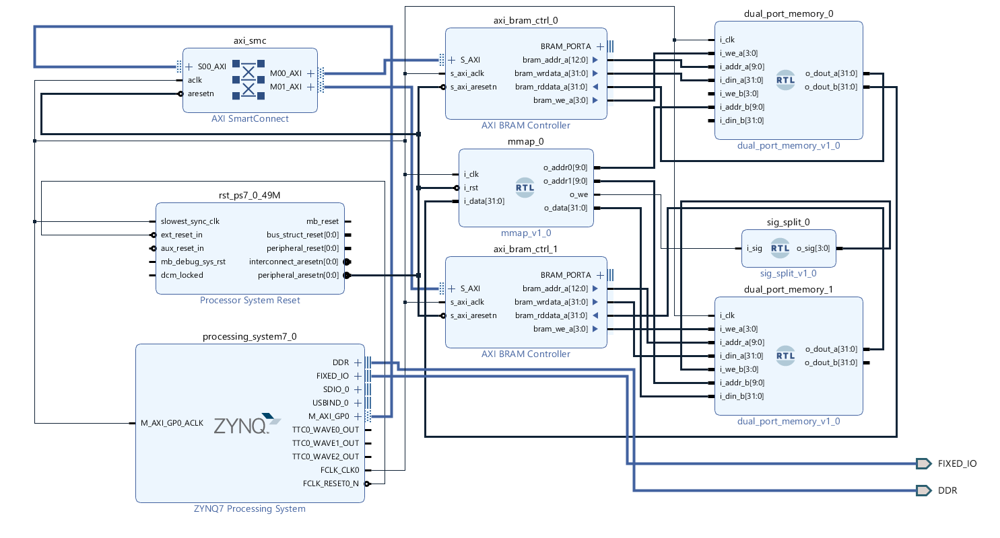
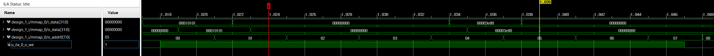
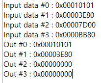
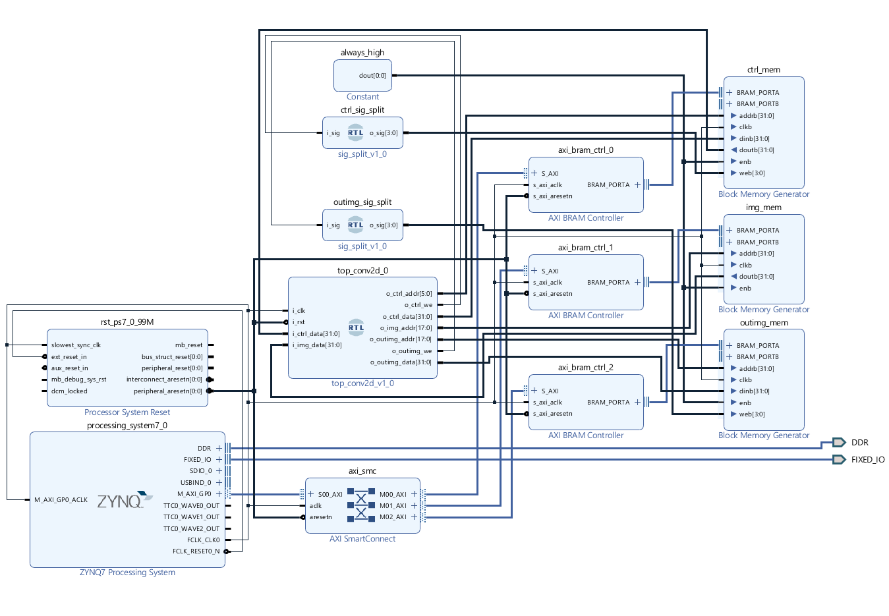
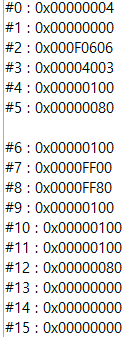
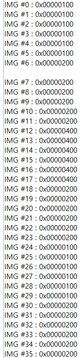
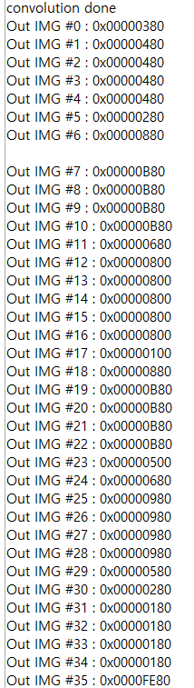
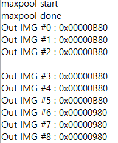

<h1> hw / sw co-design </h1>
<h3> Requirements </h3>

* Vivado 2018.3
* Python
* ZYNQ Z7020 board or greater (i'm using edge fpga z7020 board)
* OV7670 camera

---
---

<h3> mio test</h3>
if you want to test memory i/o structure, access to  

* RTL/mmap_test 
* C/mmap.c 

---
---
<h3> Small convolution reference test </h3>
Use  

* C/testheader_6x6_files,  
* RTL/conv2d_6x6/conv2d_universal.v, mux_2x1.v, PE.v, top_conv2d.v,  
* RTL/sig_splitter  

| CTRL | IMG  | RESULT |
|------|------|--------|
|  |  |  |

* Validation --> py/test_layer/test_layer.ipynb

---

<h3> Conv with maxpool</h3>

Use 

* C/testheader_6x6_files/img_wrtest_with_maxpool.c

* RTL/top.v

* RTL/conv2d_6x6

* RTL/maxpool2d

* RTL/sig_splitter

<h4>If the slack is negative</h4>

* Make your PL clock to 25Mhz or lower

