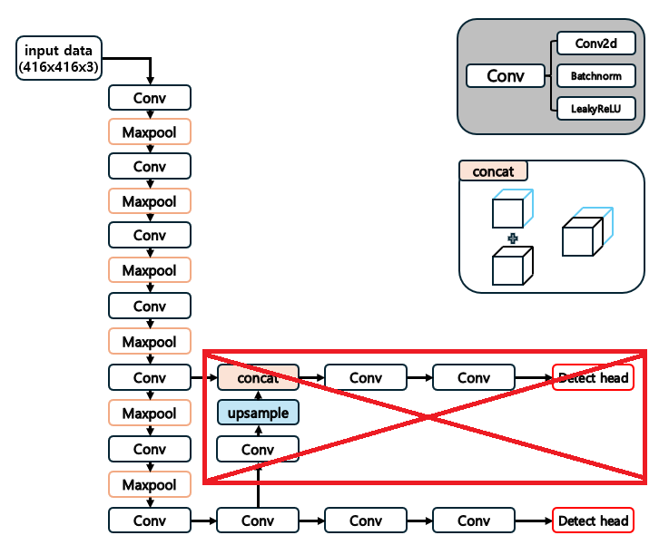

# yolov3-tiny-accelerator

Warning! not done project

[testing] accelerate conv, maxpool in yolov3-tiny w. Verilog, vivado 

<h3>Quickstart</h3>

1. run all code in py/read_weights.ipynb
2. generate JSON, npy, txt, and header file

<h3> Requirements </h3>

* Vivado 2018.3
* Python
* ZYNQ Z7020 board or greater (i'm using edge fpga z7020 board)
* OV7670 camera

<h3>Model</h3>

 use yolov3-tiny, more simple structure to detect big objects and accelerated in conv2d

---
---

<h3> mio test</h3>
if you want to test memory i/o structure, access to RTL/mmap_test, C/mmap.c 

